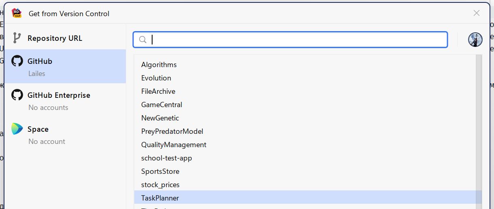

# Работа с проектом


В данном проекте используется система контроля "Git"

Она будет спользоваться для версионирования, работы с удаленным репозиторием и хранением изменений.

В данном пособии будет расказано о том, как работать с Git в контексте работы над проектом. Будут расказаны общие шаги.

Если Git еще не установлен на вашем ПК, то это можно сделать по ссылке: https://git-scm.com/download/win

Список удобных UI инструментов для работы с Git:
1. Intelij - все IDE от JetBrains обладают очень удобным средством для работы с Git. Все крайне интуитивно, понятно и удобно. Используя этот способ, ошибится сложнее всего.
2. VS Code - текстовый редактор, с функцией работы с Git. Стоит добавить пару плагинов, чтобы работать было проще (Рекомендую Git Graph и Git Lens). Но все равно, куда хуже и менее понятный, нежели InteliJ
3. Fork - классный UI инструмент для работы с Git. Имеет приятный интерфейс, большой набор возможностей. Лично я с ним не работал, но все рекомедуют.
4. Sublime Merge - Git инструмент от создателей легендарного Sublime Text. Маленький, приятный, быстрый.

Работать можно так же из терминала. Навыки работы в терминале лишними не будут. А еще они вызовут уважение коллег и вы сможете изображать хакера как в голливудских фильмах. И пускай этот способ в 10 раз медленнее и подвержен ошибкам больше, чем что либо.

## Начало работы

Для начала работы над проектом надо склонировать репозиторий.

Делается это командой `git clone`

URL нашего проекта: https://github.com/SUAI-TaskPlanner-Contest/TaskPlanner.git

Выполняется это следующей командой в терминале:

```bash
git clone https://github.com/SUAI-TaskPlanner-Contest/TaskPlanner.git
```

Данная команда загрузит удаленный репозиторий из GitHub.

Если вы исползуете git впервые, то понадобится установить Email и имя пользователя.

Так же, можно склонировать репозиторий средствами IDE

<details>
<summary>InteliJ</summary>



</details>

Для клонировния посредством IDE необходимо будет авторизоваться в GitHub

## Создание ветки и переключение на неё

Для начала, нужно чтобы задача была issue.

Потом необходимо создать ветку в задаче:
<details>
<summary>Создание ветки в GitHub</summary>


</details>

<br>
Название ветки должно быть строго латиницей

<details>
<summary>Настройки новой ветки</summary>


</details>

<br>

Данным способом ветка создается привязанной к задаче

Для того, чтобы работать над задачей в данной ветке, необходимо взять её с удаленного репозитория и переключить локальный git на неё. Делается это следующими коммандами:

Обновляет список локальный веток
```bash
git fetch origin
```

<details>
<summary>Аналогичная команда VS Code</summary>


</details>

<details>
<summary>Аналогичная команда в InteliJ (View -> Tool Windows -> Git) </summary>


</details>


<br>

Переключает ветку на выбранную:
```bash
git checkout 11-create-сontributing-file
```

<details>
<summary>Аналогичная команда VS Code</summary>


</details>

<details>
<summary>Аналогичная команда InteliJ</summary>


</details>


<br>

Теперь можно работать!

## Отправка изменений в репозиторий

Для отправки изменений необходимо сделать следующее:

1. Закоммитить изменения
2. Сделать rebase
3. Запушить изменения

Второй пункт является опциональным, зависит от ситуации

### Коммит изменений

1. добавить созданные файлы в git, чтобы он начал их отслеживать

Добавление выбранного файла
```bash
git add "название файла"
```

<details>
<summary>Та же операция в InteliJ</summary>


</details>

Добавление всех созданных файлов
```bash
git add *
```

В InteliJ можно сделать предыдущее действие на всю папку

Коммит файлов выполняется командой 
```bash
git commit -m "Сообщение к коммиту"
```

Если нужно изменить предыдущий коммит, то нужно сделать commit ammend

```bash
git commit -a -m "Сообщение к коммиту"
```

Так же при помощи ammend, можно изменять сообщение последнего коммита

<details>
<summary>Коммит в InteliJ</summary>


</details>

<details>
<summary>Коммит в VS Code</summary>


</details>


### Rebase ветки

rebase нужен в случае, если в ветку main были добавлены коммиты другими участниками команды. В этом случае, ваша ветка будет отставать от main удаленной. Её можно будет запушить, но влить в main будет нельзя.

Есть два пути:
1. Сделать merge
2. Сделать rebase

Первый путь сложный, тернистый и это вызовет сложности, так как будет по сути две ветки, вместо одной. Как замену этого, можно сделать так, чтобы ваша ветка брала начало не от того коммита, что был при создании ветки, а от самого последнего. По сути, удалить ветку, запомнив все ваши коммиты, создать свежую, и скопировать коммиты туда.

rebase весьма сложная команда. Подробно про нее можно прочитать [здесь](https://git-scm.com/book/ru/v2/%D0%92%D0%B5%D1%82%D0%B2%D0%BB%D0%B5%D0%BD%D0%B8%D0%B5-%D0%B2-Git-%D0%9F%D0%B5%D1%80%D0%B5%D0%B1%D0%B0%D0%B7%D0%B8%D1%80%D0%BE%D0%B2%D0%B0%D0%BD%D0%B8%D0%B5) 

Но, к счастью для всех, во всех IDE, есть встроенное средство для этого:

<details>
<summary>Пример в VS Code</summary>


</details>

<details>
<summary>Пример в InteliJ</summary>


</details>


<br>
Остается только выбрать на какую ветку сделать rebase. Это нужно сделать на main ветку, так как ветка будет вливаться в неё.
<br>
<br>

Во время rebase, очень часто возникают конфликты. Конфликты, как и в жизни между людьми, надо решать. В этом случае, в IDE показывается окно с тремя секциями. Слева ваш код что вы хотите добавить, справа тот код, что есть remote-ветке (или в которую хотите влить изменения), и по середине код, который будет принят. IDE подсвечивает места, где конфликты. Конфликт это когда Git не может слить два файла. Это бывает что в одной и той же строке написано разное. Для этого надо написать в окно посередине нужный вариант. Думаю что в нашем случае, это будет довольно редко.
<br>
<br>

Может быть такое, что есть много коммитов на подобие "Save", "Save this stuff", "abcd" и других, который просто для того чтобы  не потерять работу. Перед отправкой, их надо склеить в один коммит, так как ревьюер (тот кто будет искать ошибки и делать _bonk_), будет смотреть самый последний (иначе будет дико неудобно). Делается это в IDE Jetbrains парой кликов, (правая кнопка мыши по выбранным коммитам и squash), но в терминале и VScode это делать неудобно. Ссылка: https://htmlacademy.ru/blog/git/how-to-squash-commits-and-why-it-is-needed

<details>
<summary>Склеивание (сквош) коммитов в InteliJ</summary>


</details>

После этой операции, можно сказать что ветка готова к отправке

### Отправка ветки в репозиторий! PUSH!

Пришло время показать миру (нашей команде), что вы сделали. Или просто сохранить это, чтобы случайно удалив локально свою работу, не потерять её. А ещё, чтобы балуясь с GIT, не удалить её. У меня это было раза 3. 

Есть два способа:

1. Обычный push 

```bash
git push TaskPlanner "название локальной ветки":"название remote ветки"
```

Данная команда отправляет на удаленный репозиторий коммиты из выбранной вами ветки. Самая простая команда.

2. Force push

_Игрушка дьявола_

Команда, на сколько необходимая, на сколько опасная
```bash
git push TaskPlanner "название локальной ветки":"название remote ветки" --force
```

Данная команда делает тоже самое, что и предыдущая. Но с большим отличием. Обычно push добавляет в remote ветку коммиты из вашей локальной ветки. Для этого необходимо, что бы ветки были синхронизированны (имеют начало в одном и том же коммите, и имеют одни и те же коммиты). Но после rebase, ваша ветка будет иметь начало в другом коммите. Поэтому обычный push будет невозможен. 

Опция `--force` полностью **ЗАМЕНИТ** remote ветку на ту, что у вас локально. Это самый простой способ разрешить конфликты веток. Стоит обратить внимание, что **ВСЕ** коммиты что были в remote ветке, что не было у вас, пропадут. Они остануться только локально у того, кто их делал. Поэтому, если над задачей работают двое, надо быть внимательным, чтобы не удалить так работу своего товарища. Нервные клетки, как и код, удаленный форспушем, не восставливаются.

После всех этих действий, можно сказать что ваш код отправлен на удаленный репозиторий, в GitHub. Можно было бы вас проздравить, но вас ждет вторая часть эпопеи, описанная в [руководстве по оформлениюю merge request-ов](./MergeRequest.md).
